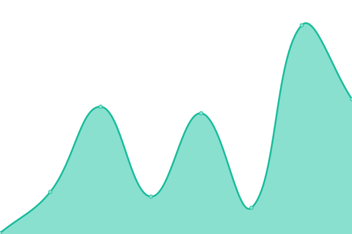
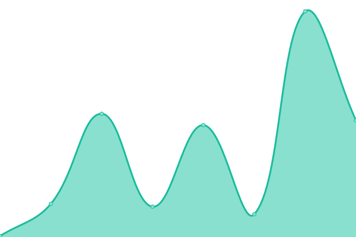
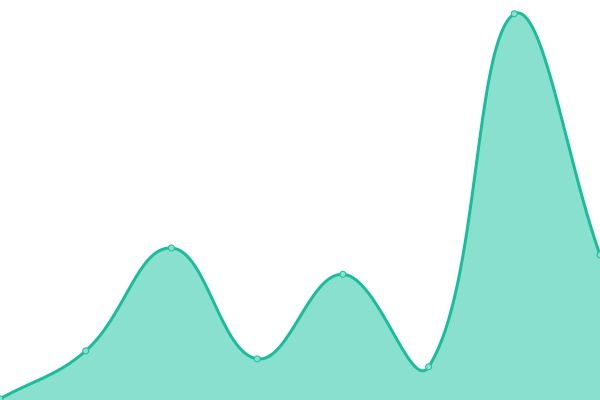
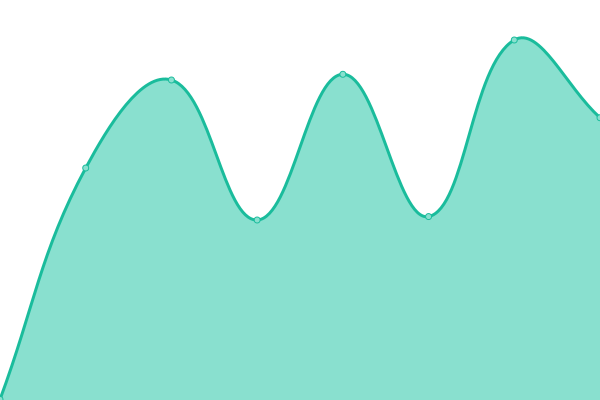

# [📈 Live Status](https://absozero.github.io/uptime): <!--live status--> **🟩 All systems operational**

This repository contains the open-source uptime monitor and status page for [Absozero](https://linktr.ee/Absozero), powered by [Upptime](https://github.com/upptime/upptime).

With [Upptime](https://upptime.js.org), you can get your own unlimited and free uptime monitor and status page, powered entirely by a GitHub repository. We use [Issues](https://github.com/absozero/uptime/issues) as incident reports, [Actions](https://github.com/absozero/uptime/actions) as uptime monitors, and [Pages](https://absozero.github.io/uptime) for the status page.

<!--start: status pages-->
<!-- This summary is generated by Upptime (https://github.com/upptime/upptime) -->
<!-- Do not edit this manually, your changes will be overwritten -->
<!-- prettier-ignore -->
| URL | Status | History | Response Time | Uptime |
| --- | ------ | ------- | ------------- | ------ |
|  [Portfolio](https://absozero.github.io) | 🟩 Up | [portfolio.yml](https://github.com/absozero/uptime/commits/HEAD/history/portfolio.yml) | 

 152ms
     
 | 

<a href="https://absozero.github.io/uptime/history/portfolio">100.00%</a>
    

|  [Blog](https://absozero.github.io/blog) | 🟩 Up | [blog.yml](https://github.com/absozero/uptime/commits/HEAD/history/blog.yml) | 

 93ms
     
 | 

<a href="https://absozero.github.io/uptime/history/blog">100.00%</a>
    

|  [Galact](https://absozero.github.io/galact) | 🟩 Up | [galact.yml](https://github.com/absozero/uptime/commits/HEAD/history/galact.yml) | 

 96ms
     
 | 

<a href="https://absozero.github.io/uptime/history/galact">100.00%</a>
    

|  [Bosa-bot](https://absozero.github.io/bosa-bot) | 🟩 Up | [bosa-bot.yml](https://github.com/absozero/uptime/commits/HEAD/history/bosa-bot.yml) | 

 87ms
     
 | 

<a href="https://absozero.github.io/uptime/history/bosa-bot">100.00%</a>
    

|  [My Github](https://github.com/absozero) | 🟩 Up | [my-github.yml](https://github.com/absozero/uptime/commits/HEAD/history/my-github.yml) | 

 345ms
     
 | 

<a href="https://absozero.github.io/uptime/history/my-github">100.00%</a>
    

<!--end: status pages-->

[**Visit our status website →**](https://absozero.github.io/uptime)

## 📄 License

- Powered by: [Upptime](https://github.com/upptime/upptime)
- Code: [MIT](./LICENSE) © [Absozero](https://linktr.ee/Absozero)
- Data in the `./history` directory: [Open Database License](https://opendatacommons.org/licenses/odbl/1-0/)
